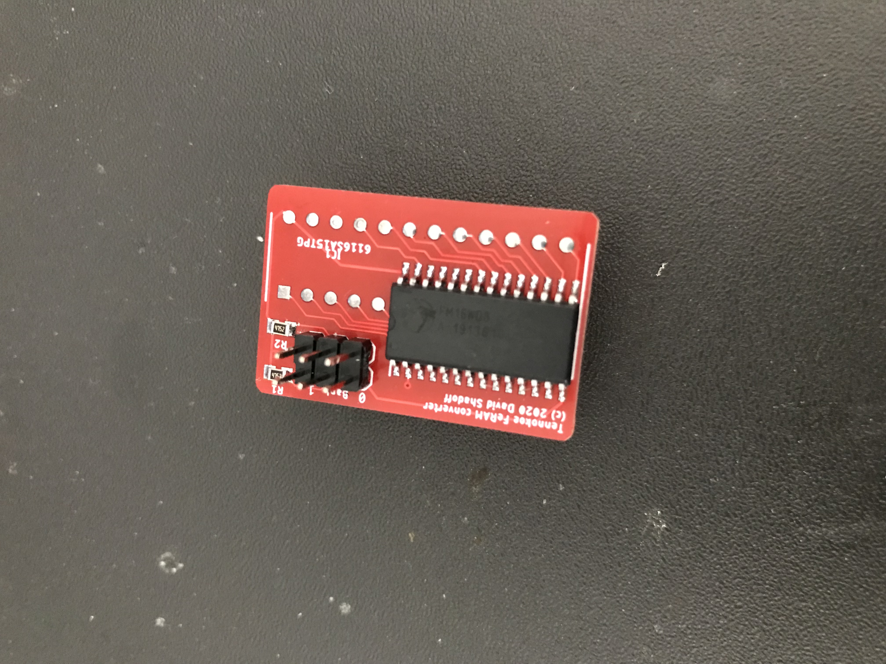
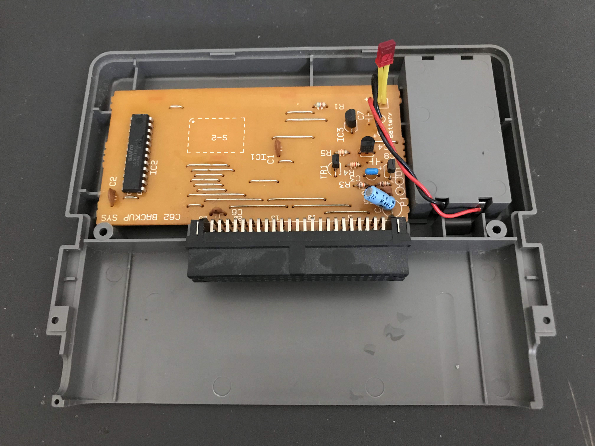
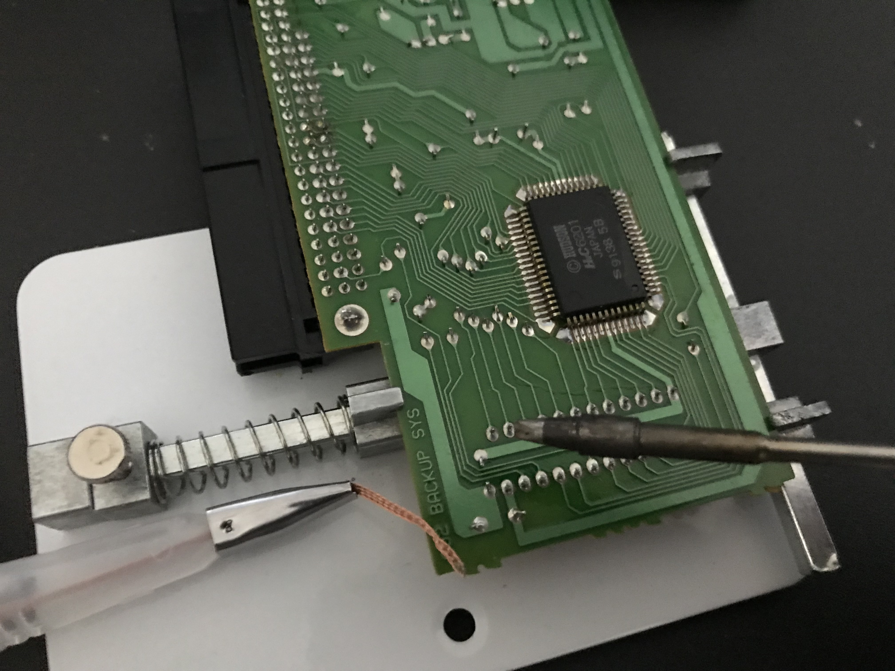
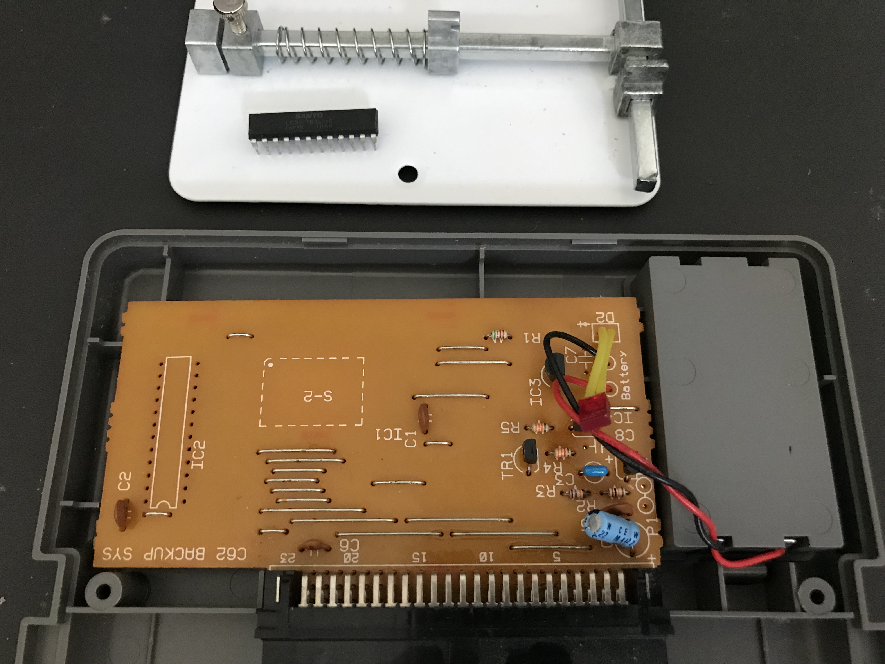
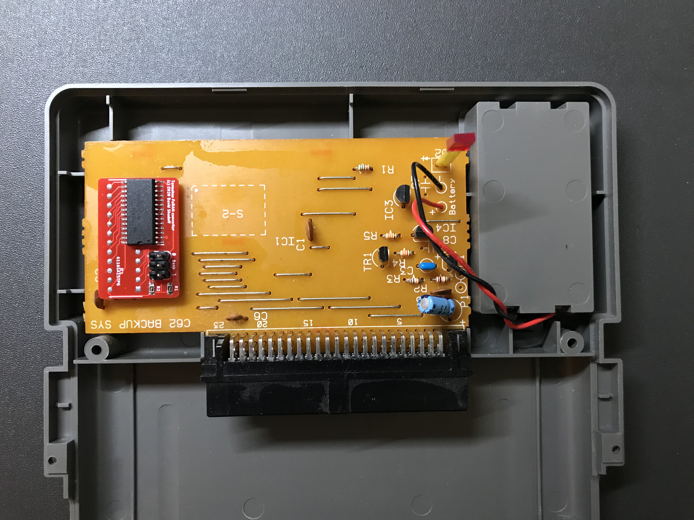

# FRAM-DIP converter board installation

The DIP board is simple enough to assemble if you have basic soldering skills. But there
are a few important points to follow.

## Assemble the module:

1. Start by preparing the 2 12-pin headers: the pins need to be pushed downward so that
no metal whatsoever protrudes through the top of the board when fitted. If you run your
finger along the solder pads, you shouldn't be able to feel the pins.  It's OK for the
pins to be slightly inset from the edge, but not too much. I ordered a 1.6mm thickness
PC board, so this made it easier to adjust (thinner would be more difficult).

2. Once all the pins are adjusted to the right length, the easiest way to keep the board
stable while mounting is to insert the headers into a solderless breadboard, and place
the board on top.  Once positioned, solder the pins into the holes until the solder
level is flush with the board. As with any solder joint, flux is your friend. I use a
flux pen for connections on boards like these.

3. Next, solder the pull-up resistors and/or jumpers or switching wires.  I placed two
47K ohm 0805 surface-mount resistors on the board to ensure that the two floating address
lines are set to something.  The jumpers are there in case you would like to occasionally
switch which bank is active (the FeRAM chip contains 4 times as much memory as the SRAM
which it replaces).  For my uses, I only wanted to use a single bank. I have set up the
board so that you can switch banks by jumper, but you could adapt it to some sort of
switch if you prefer. Just remember that it's the two middle holes which need to be
switched between logical high or low values.

4. Next, the surface-mount FeRAM chip is to be mounted. BE CAREFUL TO ORIENT PIN 1 PROPERLY !!
On a chip like this, I would align it and hold it in place while soldering one corner pin.
Then, ensuring continuing good alignment, my other hand can be freed up for more conistent
solder joints.  Careful not to overheat the chip... but I expect that you already knew that.

5. Clean the board with 99% isopropyl, and it's ready to mount.

## Desolder the chip from the Tennokoe 2:

1. If you have any game saves in the unit, you will want to back them up somehow. A
Tennokoe Bank card is probably your best option.  Next, remove the batteries from the
unit, and remove the screws holding the back of the unit on.  Once the system is open,
gently move the case to the side; the battery leads are still connected. After this
operation, you won't need the battery anymore, but I still like to leave them connected.

2. Locate the SRAM chip, and identify pin 1 (there is a notch on one end identifying it).
Turn over the board, and use a solder wick the rmove the solder from around each of the
leads. Since this is a one-layer PC board, once you wick the solder away from the pad all
the way around each lead, they move somewhat freely. In both case where I have done this,
this is all that is needed to be able to extract the chip as it moves freely. But pay
attention to any pins which might still have some solder on them.

## Replace the empty spot with the module you built earlier:

1. Once fully removed, you can insert the assembled module. PAY CAREFUL ATTENTION TO THE
ORIENTATION OF PIN 1 !!  You will want to cut the header pins closer to the board, as
they extend quite a distance beyond the board... but be careful to leave a small amount
of pin protruding, in order to get a good solder joint (being a 1-layer board, the solder
won't make a good bond through the hole, as it has on the module you made earlier).

2. Check orientation one more time !   Then solder it in.

3. You might want to test it out before reassembling the case.  If you have a Tennokoe Bank
card, this should be a good option - restore something to its memory, turn the power off,
then try it out again after a few minutes, to make sure that the memory is non-volatile.

4. When reassembling, seat the PC board properly in the back plastic shell; this is a bit
tricky, as it doesn't seem to have an optimal position at first.  When putting the top cover
on, be sure to move the LED into its position in the top case first, before closing the case
and re-fastening the screws.

## You're Done !!
