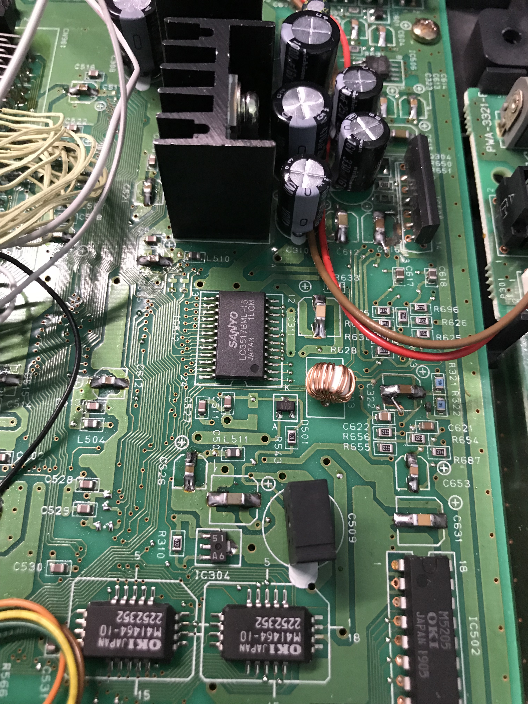
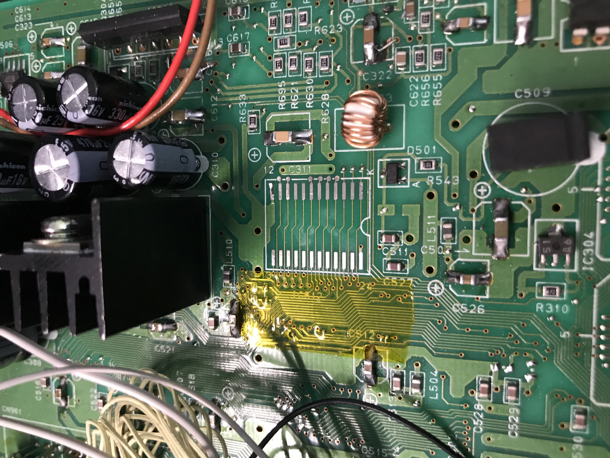
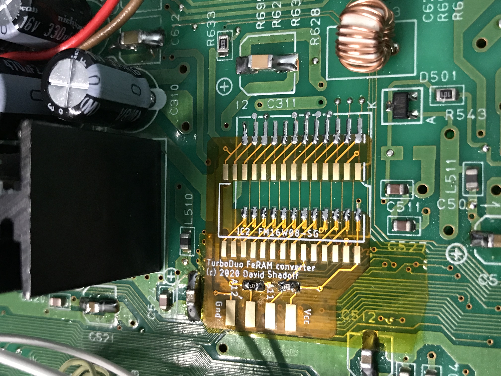
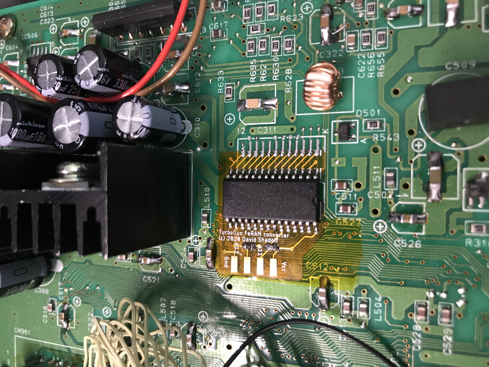

# FRAM-SOIC converter board installation - TurboDuo

I only have a Duo to demonstrate on, but I'm reasonably certain that the board will fit
other models like the Duo-R and Duo-RX.

The SOIC adapter board is simple enough to install if you are confident in your soldering
skills. But if you are just starting out, you may want to get it installed by somebody
else.

## Preparation:

1. Backup - If you have any game saves in the unit, you will want to back them up somehow.
A Tennokoe Bank card is probably your best option.

2. Open the Machine - Next, turn the unit over, and remove the screws holding the back on.
After removing the screws, turn the Duo back over so it sits as it normally would.  Next,
open the CD lid, and gently wiggle the top plastic shell off of the bottom shell... you may
see that some plastic in the CD drive area; this may be helpful to get some leverage for
gently opening the top (be careful not to touch the lens !)  Also, if your system has had
modifications done on it before, there may be wires leading to some mounting point in the
top shell; be very careful not to put any stress on these as you lift the top shell.

3. Locate the Chip - On the Duo, you will find the SRAM chip in the middle on the
left-right axis, and slightly toward the back on the front-back axis.  It's close to the
voltage regulators with their heatsinks.

Take note of where pin 1 of the chip is.

## Desolder the old chip:

This is the most difficult part of the operation, as the chip seems to be held
tightly against the board by some sort of lacquer or glue - and this is why I don't
recommend this upgrade to novices.

1. If you have a hot air station, you may wish to use it to desolder the pins - and weaken
the lacquer/glue bond.

2. If you don't have a hot air station, you should first remove as much solder as possible
from the leads, using a solder wick. As you apply heat on a second pass, you will need to
lift the pins from the pads as well.  Removing the actual chip from the board may require
isopropyl alcohol, but as you try to lift it, be careful not to damage the board or any of
the copper traces !  Once it's off, go back around the pads with the solder wick to clean
them up, and use the alcohol once more to clean the area.

## Apply the Flex PC Board:

1. You'll notice that the Duo PC board has some exposed via's; although the flex PC board
doesn't expose any traces, I felt it was better to lay down a strip of Kapton tape, just
in case.

2. Position the flex PC board as shown in the photo below, with the "U" of the board facing
pin 1's end. As the board is a little tricky to position, and shifts easily, I used another
pice of Kapton tape to position it and hold it in position as I soldered.  Be careful to
ensure that the felx PC board's castellations and inset via hole are both on the corresonding
SMD trace, and that they make a good solid connection when soldered.

## Solder the FeRAM chip:

1. You have a couple of choices before mounting the FRAM chip - you should decide whether
you are just planning to have a single backup RAM storage area, or whether you would like
as many as four (since the chip's capacity is that large).  In either case, you should solder
the two 47K pull-up resistors on the board.  We'll get to the choice in a moment.

2. Position the FeRAM carefully on the board, and be careful to ensure the correct
orientation for pin 1.  Solder in place (I'm assuming that you've soldered a similar SMD
device in the past)

3. Now for the choice.  In my case, I was only intersted in replacing the original, single
BRAM area, so I was done at this point.  However, if you want more, you will need to create
some sort of switching setup.  On the left edge of the board, you will notice a series of
four solder tabs: the outer tabs are for ground and Vcc (logical states '0' and '1'); the
middle two pads are for selecting the bank. The pull-up resistors bring these pins to the
'1'/'1' state automatically, so really you only need to ground either or both of these
address lines in order to select another bank.  I'll leave the exact type of switch to you.

4. So that you don't leave those tabs (with both ground and power) exposed, you may want to
use another piece of Kapton to cover that flap and anchor it to the board.

5. Before reassembling the case completly, you might want to test it out.  If you have a
Tennokoe Bank card, this should be a good option - restore something to its memory, turn
the power off, then try it out again after a few minutes, to make sure that the memory is
non-volatile.

## You're Done !!
